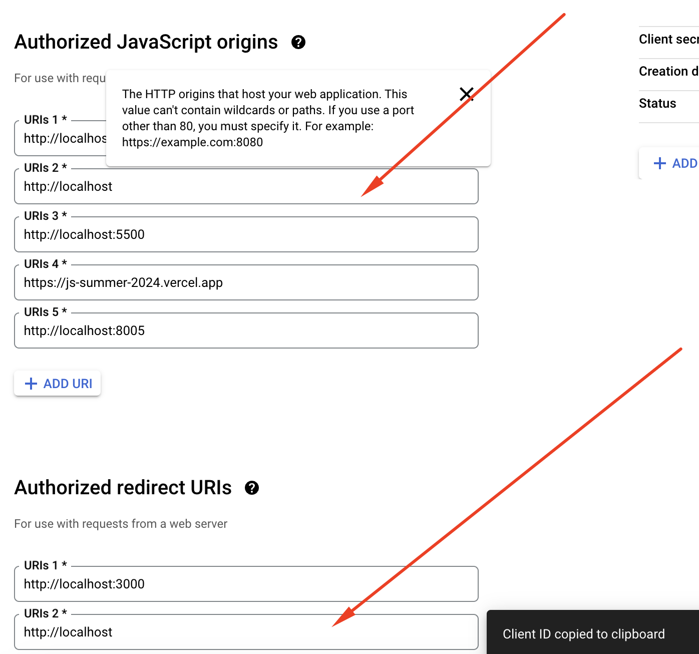

# bước 1
truy cập vào đây tạo một tài khoản google account cho sso
https://console.cloud.google.com/
lấy key clientId: ví dụ 1059530540508-6pp5ldhk1i9qoounau8s6pdvmdhhlnok.apps.googleusercontent.com
nhớ gắn link vào để có thể run được

# bước 2 chạy code để tận hưởng thành quả
php -S localhost:8000
> [!TIP]  
> Các bạn tiếp tục xử lý như lưu thông tin đăng nhập vào db cho các mục đích sau này
